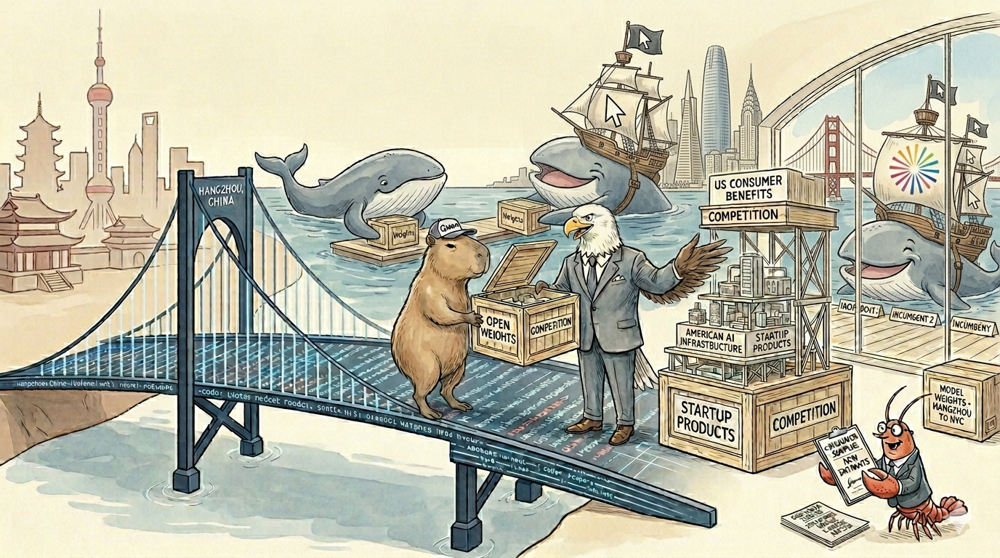

# The Distillation "Heist" Is Quietly Powering American AI

<figure class="hero-figure">
  
  <figcaption>Open weights cross the bridge from Hangzhou and get turned into American startup products, infrastructure revenue, and consumer competition. <em>(Illustration generated with Gemini.)</em></figcaption>
</figure>

A recent Foreign Affairs piece, [*China's AI Heist*](https://www.foreignaffairs.com/china/chinas-ai-heist), argues that Chinese labs distilling US frontier models constitutes "industrial-scale extraction" that threatens to lose the United States the AI "distribution war." It calls for extending the Foreign Direct Product Rule to cover Chinese open-weight models, formal entity designations, and IEEPA-backed asset freezes — and frames all of this in the cadence of a national emergency.

**The framing is incautious and reads more talking-head than policy analysis.** The proposed remedies misdiagnose the phenomenon, would hurt the firms they claim to protect, and rest on a slippery slope from "weights" to "geopolitical dependence" that does not survive contact with the actual deployment topology of these models. The piece is right that distribution matters as much as training. It is wrong about who is winning it, and it is not quite right about what to do.

Three points.

## 1. Chinese open weights *create* American competition that wouldn't otherwise exist

Without Chinese open-weight releases, the American frontier-AI market would consist of OpenAI, Anthropic, and Google DeepMind — plus a long tail of wrapper products that depend on their APIs. The models they've built are great and their IP should be protected, but villainizing the presence of Chinese open-source models is a mistake. *With* Chinese open-weight releases, there is a robust American middle layer building competitive products on top: post-training labs, neo-clouds, RL-as-a-service companies, and at least one multibillion-dollar end-user product. That middle layer is what keeps the three frontier labs from segmenting the market by vertical and pricing as comfortable incumbents.

Cursor is one telling case. While it delivered some in-house models like Tab for auto-complete, the core AI features that launched it from $500M to $2B in annualized revenue between June 2025 and February 2026<strong>Cursor ARR trajectory</strong> $100M ARR Jan 2025, $500M June 2025, $1B Nov 2025, $2B Feb 2026 — fastest SaaS scaling on record. Now in talks to be bought at $60B. <a href="https://sacra.com/c/cursor/" target="_blank" rel="noopener">Sacra: Cursor revenue & funding</a> — Chat, Composer, and Agents — ran on routing to Anthropic and OpenAI APIs. Rather than being locked into that dependence, Cursor could ship its own in-house model — better controlling its margins and pricing leverage at scale — by building Composer 2 on top of Kimi K2.5, an open-weight Chinese base model from Moonshot AI<strong>Composer 2 base model (officially confirmed)</strong> Cursor co-founder Aman Sanger and VP DevEd Lee Robinson confirmed in March 2026 that Composer 2 was built on Kimi K2.5 after the base model was identified in API headers. Cursor reports ~3/4 of total training compute came from its own continued pretraining + RL on top of Kimi. Moonshot's official account confirmed the partnership runs through Fireworks AI under a commercial license. <a href="https://cursor.com/blog/composer-2-technical-report" target="_blank" rel="noopener">Cursor: Composer 2 technical report</a> <a href="https://techcrunch.com/2026/03/22/cursor-admits-its-new-coding-model-was-built-on-top-of-moonshot-ais-kimi/" target="_blank" rel="noopener">TechCrunch coverage</a>, with roughly three-quarters of Composer 2's total training compute coming from Cursor's own continued training on top of the Kimi base. This is not "Cursor shipping a Chinese model" or "Cursor being locked into a Chinese software ecosystem." It is Cursor freely fine-tuning an open-weight LLM checkpoint into another competitive American coding model. This drives [innovation](https://cursor.com/blog/self-summarization), protects consumers from a monopoly, and would not exist without a high-quality open-weight base to start from.

<!-- encouraging progress in technology and protecting consumers from a monopoly, and would not exist without a high-quality open-weight base to start from. The point generalizes: every American AI product company that wants to control its own model economics — rather than live on API margin from the Big 3 forever — currently has two choices, raise $100M+ to train from scratch, or build on top of an open-weight base. Almost all are choosing the latter, and the highest-quality open-weight bases available right now happen to be Chinese. -->

The same dynamic is happening one layer down. The American neo-cloud and inference layer — Fireworks AI at $315M ARR, up 416% YoY<strong>Fireworks AI ARR</strong> $315M ARR Feb 2026, +416% YoY; customer base grew from ~1,000 to 10,000+ companies in 2025. <a href="https://sacra.com/c/fireworks-ai/" target="_blank" rel="noopener">Sacra: Fireworks AI</a>, Together AI at roughly $150M ARR<strong>Together AI revenue</strong> Raised $305M Series B Feb 2025; generates ~$150M+ annualized revenue from open-model inference hosting. <a href="https://sacra.com/c/together-ai/" target="_blank" rel="noopener">Sacra: Together AI</a>, plus Groq, Cerebras, and SambaNova on custom American silicon — built nine-figure businesses on top of serving and post-training the open-weight models the Foreign Affairs piece wants to restrict. The RL-as-a-service layer is similarly American-owned, American-built, <strong>US RL-as-a-service companies</strong> The current generation of post-training and RL-as-a-service providers — building enterprise pipelines on top of open-weight bases — are overwhelmingly US-founded firms. <a href="https://thinkingmachines.ai" target="_blank" rel="noopener">Thinking Machines</a> <a href="https://www.appliedcompute.com" target="_blank" rel="noopener">Applied Compute</a> <a href="https://www.primeintellect.ai" target="_blank" rel="noopener">Prime Intellect</a> and American-served<strong>Thinking Machines × NVIDIA partnership</strong> Thinking Machines and NVIDIA announced a multi-year strategic partnership to deploy at least one gigawatt of next-generation NVIDIA Vera Rubin systems for Thinking Machines' frontier model training, with deployment targeted for early next year — illustrating the broader pattern of US post-training firms running on US compute. <a href="https://thinkingmachines.ai/news/nvidia-partnership/" target="_blank" rel="noopener">thinkingmachines.ai/news/nvidia-partnership</a>, while similarly being supported and enabled by a set of [capable open-weight starting points](https://tinker-docs.thinkingmachines.ai/tinker/models/), some of which happen to be Chinese. None of this revenue, and none of this competitive pressure on the Big 3, exists without the open-weight releases.

The underlying economics explain why: DeepSeek-V3's final training run reportedly cost $5.576M in H800 hours<strong>DeepSeek-V3 training cost</strong> 2.788M H800 GPU-hours total (pre-training + context extension + post-training) at $2/hr = $5.576M. Excludes prior research and ablations. From the DeepSeek-V3 technical report. <a href="https://arxiv.org/abs/2412.19437" target="_blank" rel="noopener">arXiv:2412.19437</a> — orders of magnitude less than what frontier US labs spend. Restricting access to these bases would not strengthen American competition. It would restrict it to whoever can afford a multi-hundred-million-dollar training run, which is exactly the three incumbents the middle layer is currently keeping honest. The likely result is not "American AI leadership" in any distributed sense; it is a narrower, more concentrated American AI industry in which OpenAI, Anthropic, and Google DeepMind face less domestic competition than they do today.

## 2. "Open weights" and "geopolitical dependence" are not the same thing

The piece's central causal claim is a slippery slope: a developer picks DeepSeek for cost, then Alibaba Cloud for hosting, then Huawei chips for compute, and "what starts as a cost-driven choice becomes a full-stack, enduring dependence." This is asserted, not argued.

Open weights are decoupled from where they originated. Chinese open-weight models accounted for 17.1% of global AI model downloads in the year through August 2025<strong>Open-weight download share</strong> Chinese models reached 17.1% of global AI model downloads in the year through August 2025, overtaking US download share in some measurements after R1's January 2025 release. <a href="https://www.digitaltoday.co.kr/en/view/49856/" target="_blank" rel="noopener">DigitalToday coverage</a>, and the overwhelming majority of those downloads ran on American-built infrastructure: Hugging Face (US), vLLM and SGLang (US universities), llama.cpp (a primarily Western community project), and Apple Silicon and Nvidia hardware on the device side. Hugging Face data showed user-generated derivatives of Qwen-family models exceeded the combined total of Google and Meta models<strong>HF derivative model counts</strong> Per Hugging Face activity data (late 2025), derivative/fine-tuned versions of Alibaba's Qwen family on the platform exceeded the combined total of Google and Meta open-weight derivatives. <a href="https://www.digitaltoday.co.kr/en/view/49856/" target="_blank" rel="noopener">DigitalToday coverage</a> — that is a flood of American and global developers fine-tuning Chinese weights toward their own ends, which is approximately the opposite of "enduring dependence on Beijing."

A US enterprise running Qwen on AWS is not dependent on Alibaba in any sense that resembles a Huawei 5G customer being dependent on Huawei. The telecom analogy the piece reaches for requires infrastructure the user cannot replicate. Weights are exactly the opposite — they are the thing the user owns once downloaded.

The right precedent is not Huawei or Belt and Road. It is PyTorch and Linux. PyTorch was developed at Meta and became the world's de facto deep-learning framework — used by every American lab, every Chinese lab, every research group on earth — and no one seriously argues that Meta "controls" global AI research as a result, because PyTorch is genuinely open: anyone can read it, fork it, and modify it. PyTorch is now governed by the PyTorch Foundation under the Linux Foundation<strong>PyTorch governance</strong> In September 2022, Meta transferred PyTorch governance to the PyTorch Foundation under the Linux Foundation. The project is now multi-stakeholder, with member contributions from AMD, AWS, Google, Meta, Microsoft, and Nvidia. <a href="https://pytorch.org/foundation" target="_blank" rel="noopener">PyTorch Foundation</a>, and "American origin" has become a historical fact about the project rather than an ongoing source of geopolitical leverage. Linux was written by a Finnish student and now runs over 96% of the world's top one million web servers and the entire Android ecosystem<strong>Linux deployment scale</strong> Linux runs ~96% of the top 1M web servers and is the kernel underlying Android (~70% of global mobile market share), ChromeOS, embedded systems, and most cloud infrastructure. "Finnish geopolitical influence over computing" is not a meaningful category despite this scale. <a href="https://w3techs.com/technologies/details/os-linux" target="_blank" rel="noopener">W3Techs server share</a> — and "Finnish geopolitical influence over computing" is not a meaningful category, because the kernel is forked and rebuilt by every vendor that ships it. The piece's framing requires Chinese-origin open weights to be categorically different from these precedents. It does not explain why.

Vendor lock-in is a real phenomenon and worth taking seriously. It happens when migrating away from a vendor is costly because of proprietary formats, data egress fees, integrated services, hardware tying, or licensing tail. None of these apply to open weights. Downloading Qwen does not bind a developer to Alibaba's cloud. Running DeepSeek on AWS does not generate a contractual or technical relationship with DeepSeek. There is no proprietary inference engine, no licensing renewal, no upgrade path that compels continued use of any Chinese product. If a better US-developed equivalent appears tomorrow, switching cost is: download the new weights. The "creep" the piece describes — model adoption leading inexorably to cloud adoption leading inexorably to chip adoption — requires a causal mechanism that the piece never specifies, because there isn't one. The mechanism it gestures at (network effects, ecosystem gravity) actually runs the other direction: developers already on AWS, Apple Silicon, and Hugging Face have every reason to *stay* on American infrastructure even as they swap which weights they fine-tune.

The piece's most empirically-grounded concern is embedded political behavior — the CrowdStrike finding that DeepSeek-R1 produced ~50% more vulnerable code when prompts mentioned politically sensitive terms like "Tibet" or "Uyghurs," and the broader observation that safety training does not transfer through distillation<strong>Anthropic distillation claims</strong> Feb 2026: Anthropic alleged DeepSeek, Moonshot, and MiniMax used ~24,000 fake accounts and 16M+ exchanges to extract Claude's capabilities. Safety filtering and alignment tuning are applied post-training and do not transfer to distilled models. <a href="https://techcrunch.com/2026/02/23/anthropic-accuses-chinese-ai-labs-of-mining-claude-as-us-debates-ai-chip-exports/" target="_blank" rel="noopener">TechCrunch coverage</a>. This is real and worth investigating. But it does not justify the remedy. Trained-in bias and missing safety scaffolding are exactly what the American post-training ecosystem already specializes in: alignment via fine-tuning, RL-from-human-feedback, and safety filtering have been core parts of American post-training pipelines and products since ChatGPT's launch in 2022. Unless the claim is that Chinese labs are smuggling spying code into the weights themselves — which is a pretty interesting question to research or investigate — these behavioral artifacts are downstream-addressable by precisely the American companies the policy would harm.

## 3. The proposed remedies have a track record, and it doesn't favor them

The piece asks Washington to extend FDPR to AI models, citing its success against networking equipment and semiconductor tools. The more recent and more relevant precedent — the H100, H800, and B200 chip controls — is one the piece does not engage with, and it should.

The chip controls did not stop Chinese model progress. They forced it into a more compute-efficient regime — precisely the regime in which DeepSeek-V3 and R1 emerged, trained on the very H800s that the export controls produced as a workaround. They accelerated Huawei Ascend and SMIC roadmaps that were, beforehand, second-tier commercial projects. And they cost Nvidia an estimated $5.5B in immediate charges plus a projected $15B in lost China revenue as of April 2025<strong>Nvidia China revenue impact</strong> April 2025: Nvidia disclosed a $5.5B charge from the inability to ship H20 processors to China, plus a projected additional $15B in lost revenue from the Chinese market due to extended export restrictions. <a href="https://www.csis.org/analysis/understanding-biden-administrations-updated-export-controls" target="_blank" rel="noopener">CSIS analysis</a> — revenue that funds the next generation of American AI training. The net effect on US AI leadership is, charitably, ambiguous.

Extending an FDPR-style regime to *models* would compound this. American frontier labs would lose a downstream commercial market. American neo-clouds — the Fireworks and Together AIs of the world that built nine-figure businesses serving these weights — would lose a substantial share of revenue. American startups would lose the cheap, capable open-weight backbone they currently build on. And Chinese labs, having already absorbed the lessons of the chip controls, would respond by training more from scratch — a path they are well-resourced to take, and one that, by the piece's own logic, would produce models with *more* distinctive behavioral artifacts, not fewer. Restriction makes the problem the piece identifies worse.

If the concern is American AI leadership, the lever is not restricting how Americans can use foreign open-weight models. It is what the piece correctly identifies as a secondary recommendation and should have made primary: funding and incentivizing American firms to release competitive open-weight models. Gemma 4 is a step. Llama has lost ground that needs to be recovered. The actual policy is *more American open weights, not fewer Chinese ones*.

## What a serious response actually looks like

None of the above means unauthorized extraction is harmless. If Chinese labs are running fraudulent accounts at scale to evade API terms of service and systematically harvest the outputs of frontier American models, that conduct should be investigated and punished. Frontier labs should harden their APIs against extraction, share abuse indicators across firms, watermark outputs where it helps, and pursue civil enforcement where the evidence supports it. The U.S. government can help by treating documented, state-linked extraction campaigns as commercial misconduct backed by enforceable instruments — not as a vague atmospheric threat that justifies broad restrictions on the open-weight ecosystem downstream of those campaigns.

But that is a very different thing from treating every Chinese-origin open-weight model as contraband, or every American company that builds on one as a vector of geopolitical dependence. The policy target should be the conduct, not the artifact. Washington should be asking who extracted what, from whom, under what terms, at what scale, and with what evidence. Without that discipline, "anti-distillation" policy becomes a general-purpose instrument for restricting open models — even when the downstream value is being captured by American clouds, American chips, American post-training firms, and American application companies.

A serious policy would have three parts:

1. **Enforce against unauthorized extraction directly.** Treat the documented conduct — fraudulent accounts, organized ToS violations at industrial scale — as commercial misconduct: civil suits, account-level countermeasures, cross-lab abuse-indicator sharing, and criminal referrals where appropriate. Penalize the *action*, not the artifact that resulted from it.

2. **Create lawful, audited distillation pathways for U.S. and allied companies.** American startups today have two paths to a frontier-competitive in-house model: raise $100M+ to train from scratch, or build on a foreign open-weight release. There should be a third — frontier labs licensing limited, output-based training to vetted U.S. and allied companies under safety review, provenance logging, usage caps, and revenue sharing. That addresses the piece's "level playing field" concern head-on, without breaking the open-weight ecosystem.

3. **Make competitive American open weights an industrial-policy priority.** Compute grants, public-benchmark prizes, procurement commitments, and university-industry consortia, all aimed at the concrete goal of making U.S. and allied open models good enough that developers choose them voluntarily. This is the lever the Foreign Affairs piece acknowledges and then de-emphasizes. It is the lever that actually works, because it shifts defaults rather than restricting them.

Finally, regulate deployment risks as deployment risks. If a model produces insecure code, contains political refusal artifacts, fails cybersecurity evaluations, or is unsafe to wrap in an autonomous local agent, that should matter — regardless of whether the weights came from Hangzhou or Hayes Valley. The serious policy question is not the nationality of the first pretraining run. It is where the model is hosted, who controls the post-training, which infrastructure captures the revenue, what safety evaluations the deployment passes, and how easily users can switch away. Each of those is a real policy lever. None of them are activated by an FDPR designation on a foreign model.

## A closing note

This is the difference between policy and policy theater. A serious response to extraction would punish the extraction, expand lawful American capability transfer, and fund American open-weight competition until the developer default shifts on its own. A performative response would ban the very open-weight ecosystem that is currently letting American firms compete with the frontier incumbents — and call it a national security measure.

"The distribution layer matters" and "the United States is losing a heist" are different claims, and the piece slides between them. The first is correct and important. The second is a narrative dressed in policy clothing. The American AI ecosystem is, on the actual numbers, winning the distribution game — on the strength of American chips, American clouds, American agentic tooling, and American post-training services, all of it amplified, not threatened, by the open-weight Chinese models the piece wants to restrict.

The answer to Chinese open-weight competition is not fewer open weights. It is a stronger American open ecosystem, and the conduct-not-artifact discipline to tell the two problems apart.

---

<small><em>The main parts of this piece were ghost-written by Claude (Opus 4.7 (1M context)) via prompt-to-prose instructions by the author, with some quips and evidence thrown in by the model, and some re-writing done by the author. The arguments are the author's own, applying that good old liberal-arts education of actually thinking about an article's points, and engaging both as an example of discourse to his lab and out of disagreement with the incautious framing of the original piece. The author would encourage others to do the same. Any errors of fact or judgment are jointly owned.</em></small>

<small><strong>Disclosure.</strong> <em>The author has previously consulted at Together AI, one of the neo-clouds mentioned by name in this piece, and has helped start an American neo-lab.</em></small>

## AppendixSupporting claims that don't hold up

Beyond the main argument, the [original piece](https://www.foreignaffairs.com/china/chinas-ai-heist) leans on a chain of supporting claims that don't carry their weight. A few of them, addressed in turn.

### "OpenClaw shows that users around the world want models that run on their own devices."

Even OpenClaw itself does not show this. OpenClaw's own documentation recommends Claude Sonnet 4.6 via the Anthropic API as the primary model, with a cloud GPT model as the recommended fallback<strong>OpenClaw recommended default</strong> OpenClaw's official model-providers documentation recommends Claude Sonnet 4.6 via Anthropic as the primary, with cloud GPT (e.g., gpt-4o or gpt-5.4) configured as the fallback. Local Ollama / vLLM / SGLang are shipped as bundled provider plugins but are not the default configuration. <a href="https://docs.openclaw.ai/concepts/model-providers" target="_blank" rel="noopener">OpenClaw docs: model providers</a>. Local Ollama, vLLM, and SGLang are shipped as bundled provider plugins, but they are not the out-of-the-box default. Community discussion around OpenClaw deployments converges on a hybrid pattern: Claude for the main conversational loop and tool-orchestration, local Ollama for bounded sub-agent tasks and routine cron jobs<strong>OpenClaw user consensus: hybrid, not local-first</strong> Reported community consensus around OpenClaw is to use cloud Claude for the main loop and local Ollama for sub-agents or routine background tasks. Teams that try "full local everything" reportedly downgrade to hybrid within weeks because the main loop is too slow and tool-call reliability collapses without a frontier model. <a href="https://clawmage.ai/blog/openclaw-ollama-reddit/" target="_blank" rel="noopener">Summary of OpenClaw Ollama discussions</a>. Teams that try "full local everything" reportedly come back to hybrid within weeks, because the main loop is too slow and tool-call reliability collapses without a frontier model behind it. So OpenClaw being the fastest-growing local-capable agent framework on GitHub is not evidence that users want on-device inference. It is evidence that users want a framework flexible enough to *route between* local and cloud — and in the routing, the recommended primary path is overwhelmingly cloud.

The same pattern recurs across other local-capable agent frameworks. OpenHands' own documentation names Claude 3 and GPT-4 as the recommended partners; developer reports describe local-only setups (Llama 3.1, codegemma, deepseek-coder via Ollama) as producing "very disappointing results"<strong>OpenHands: cloud-default in practice</strong> OpenHands explicitly recommends Claude 3 and GPT-4 as the best-performing partners. Practitioner write-ups describe local Ollama setups as failing on real agentic tasks. The framework supports local models; users route to cloud APIs in practice. <a href="https://medium.com/@mchechulin/real-world-experience-with-development-using-ai-and-openhands-61d267bc6cd2" target="_blank" rel="noopener">Developer report on OpenHands + local models</a>. Cline — one of the most-installed agent extensions for VS Code — treats Claude Sonnet as the default for agentic work and positions local routing as a cost-optimization fallback, not a primary path<strong>Cline: cloud-default, local-as-fallback</strong> Cline supports Claude, GPT, DeepSeek, Gemini, and local Ollama. Claude 3.5 / 4 Sonnet is widely described as the recommended default for agentic work; local routing is positioned as a way to save money, not as the modal user experience. <a href="https://www.morphllm.com/comparisons/cline-vs-continue" target="_blank" rel="noopener">Cline vs Continue comparison</a>. Open Interpreter is model-agnostic in principle; in practice the recommended path is GPT-4o or Claude, with local Ollama positioned for "routine scripting where response speed is not critical." The architectural pattern across these frameworks is "supports local." The revealed usage pattern is "routes to cloud." The piece treats demand for the *framework* as demand for *on-device inference*, and the data — including OpenClaw's own — does not support the conflation.

### "OpenClaw's malicious skills show the danger of open-weight models that won't refuse instructions."

This is a category error. The OpenClaw "skills" the piece describes — the 340+ malicious extensions, the top-ranked community skill that turned out to be malware — are user-submitted prompts and code in a community marketplace. They have nothing to do with model weights, Chinese or otherwise. A malicious skill executed by an agent harness with insufficient sandboxing is just as dangerous when the underlying model is Claude, GPT-4, or Llama as when it is DeepSeek. The relevant safety problem is *agent runtime sandboxing and marketplace moderation* — the responsibility of whoever built and operates OpenClaw — not the country of origin of the weights underneath. The piece conflates three distinct layers (model weights, agent runtime, community marketplace) and attributes the failure mode of the third to the nationality of the first.

### "Safety filtering doesn't transfer through distillation, therefore distilled Chinese models are uniquely dangerous."

The first half is correct and uncontroversial. The second half does not follow from it. Distillation is the *general* technique by which capability transfers and post-training safety does not — the same is true when American labs distill their own production models for cheaper deployment, when academic researchers distill open weights for evaluation, and when any developer fine-tunes a model in a way that disturbs its post-training scaffolding. The remedy in every case is the same: post-training safety work by the downstream party. That is a service American post-training firms already sell. There is no version of this argument that picks out *Chinese* distilled models specifically.

### "The Iranian strikes on AWS infrastructure show why we need to move to local."

The strikes happened, datacenters are physical targets, and resilience matters. None of this implies anything about which country's open weights to run. The piece moves from "datacenters are vulnerable" to "local is good for resilience" to "therefore the (currently mostly Chinese) open-weight ecosystem is the answer" — and the only step that is actually argued is the first one. Compute resilience is solved by diversifying *topology* (multiple regions, multiple providers, on-prem fallback). It is not solved by, and does not bear on, the choice between Qwen and Llama.

